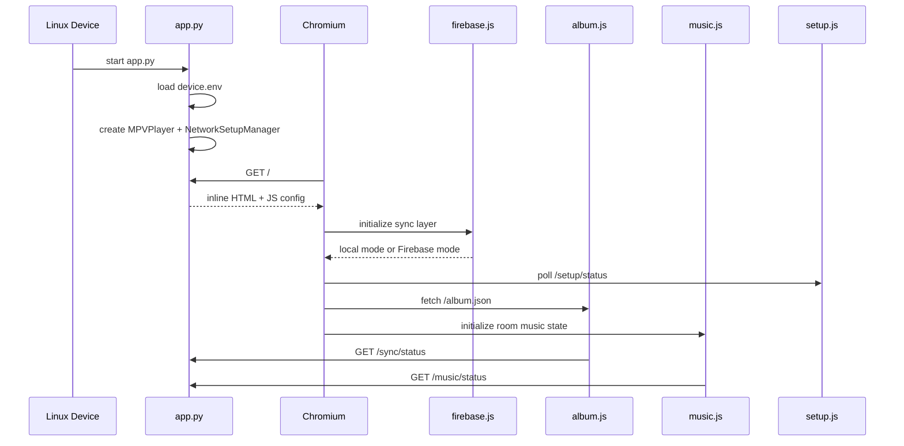
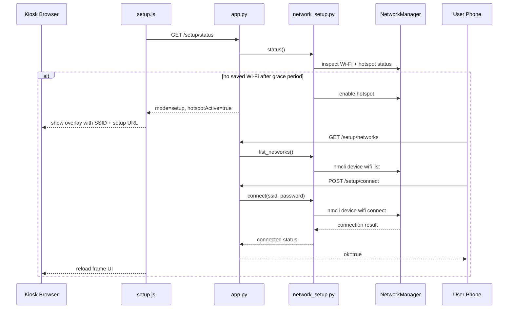
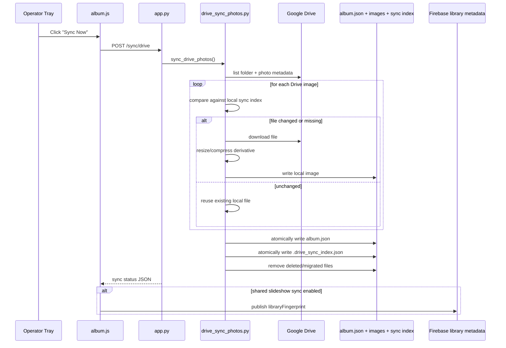
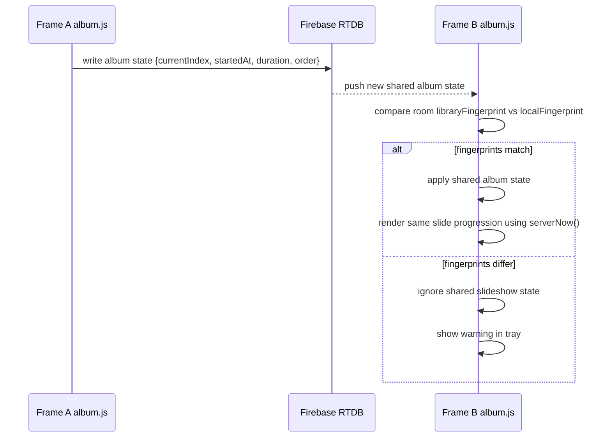
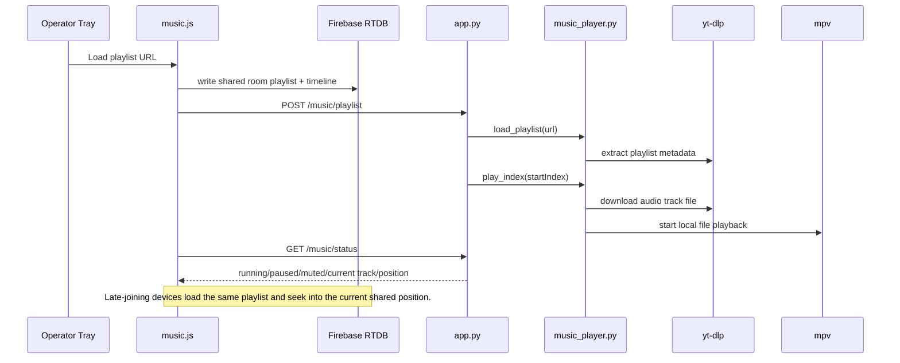
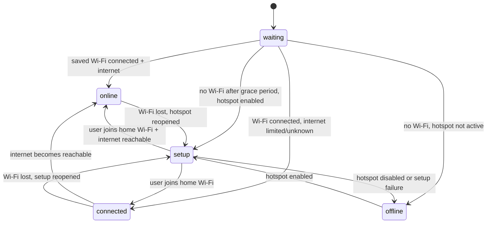

# Runtime Flows

This file focuses on "how the system behaves over time" rather than just which files exist.

## 1. App Boot Flow

## 2. First-Boot Wi-Fi Setup Flow

## 3. Manual Google Drive Sync Flow

## 4. Cross-Network Slideshow Sync Flow

## 5. Shared Room Music Flow

## 6. Network Setup State Diagram

## Key Runtime Concepts

### Shared slideshow state

The slideshow state includes:

- current sequence index
- whether playback is running
- start timestamp
- slide duration
- order/shuffle mapping
- manifest version

### Shared library metadata

The room-level library metadata is separate from slideshow position. It includes:

- `libraryFingerprint`
- `count`
- `updatedAt`
- `updatedBy`

This is what lets one frame detect that another frame has synced a different photo library.

### Local music state

Even when slideshow sync is enabled, music is intentionally local in the current device mode:

- each frame can autoplay music independently
- changing a song on one frame does not change it on another

### Incremental Drive sync

Drive sync no longer behaves like "redownload the entire folder every time." It now:

- tracks Drive file metadata in a local sync index
- regenerates local images only when files changed or cache settings changed
- stores display-sized files instead of full originals
