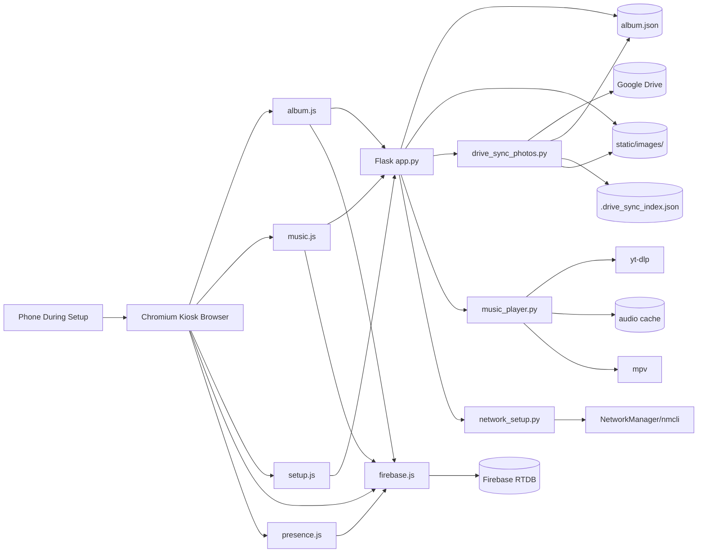
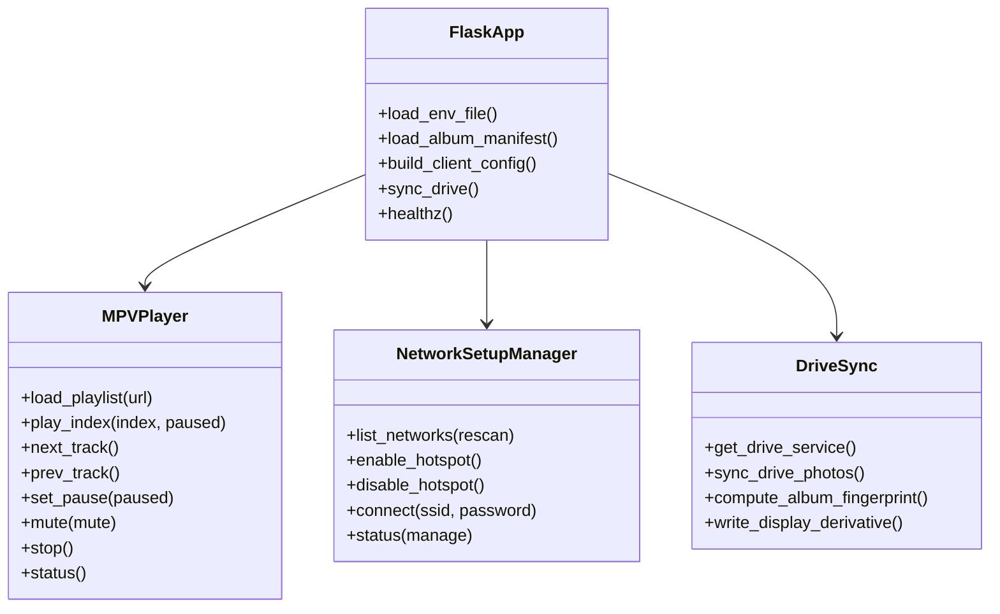

# System Overview

## What The Project Is

`Sanny Photos` is a single-screen-first photo-frame appliance that can also mirror slideshow state across multiple frames on different networks.

At a high level:

- the browser renders the fullscreen slideshow
- Flask serves the page, images, and control APIs
- Google Drive is the upstream photo library
- Firebase mirrors slideshow state across devices
- `mpv` plays the shared room music locally on each device
- NetworkManager provides first-boot Wi-Fi onboarding

## Tech Stack

| Layer | Technology | Purpose |
| --- | --- | --- |
| Backend web server | Flask | Serves the HTML shell, album manifest, images, and JSON APIs |
| Frontend UI | Vanilla JavaScript + inline HTML/CSS | Slideshow, tray controls, setup overlay |
| Music playback | `mpv` | Local audio playback on the frame |
| Track resolution | `yt-dlp` | Loads YouTube playlists and downloads audio cache files |
| Cross-device sync | Firebase Realtime Database | Shared slideshow state, library metadata, presence |
| Photo source | Google Drive API | Manual photo sync into local album + image cache |
| Local networking | NetworkManager / `nmcli` | Hotspot mode, SSID scan, connect-to-Wi-Fi |
| Image processing | Pillow | Resizes Drive-downloaded photos into display-sized derivatives |
| Local persistence | `localStorage`, BroadcastChannel, JSON files | Room state, fallback sync, album/index storage |

## Architecture Diagram

## Module Boundaries

### Backend

- [`app.py`](../../app.py): application composition point
- [`drive_sync_photos.py`](../../drive_sync_photos.py): Drive import and local cache generation
- [`music_player.py`](../../music_player.py): mpv playback engine for shared room music
- [`network_setup.py`](../../network_setup.py): Wi-Fi setup engine

### Frontend

- [`static/js/firebase.js`](../../static/js/firebase.js): sync abstraction and store creation
- [`static/js/album.js`](../../static/js/album.js): slideshow rendering, sync behavior, transitions
- [`static/js/music.js`](../../static/js/music.js): music UI and backend orchestration
- [`static/js/setup.js`](../../static/js/setup.js): setup overlay behavior
- [`static/js/presence.js`](../../static/js/presence.js): online/offline room heartbeat

## Main Runtime Responsibilities

### `app.py`

- loads `device.env`
- builds runtime config for the browser
- serves the HTML shell
- serves the canonical album manifest and image files
- exposes setup, sync, health, and music endpoints
- coordinates sync status snapshots

### `drive_sync_photos.py`

- authenticates with Google Drive
- finds the target folder
- lists photo files
- downloads only changed images
- generates display-sized derivatives
- rewrites `album.json`
- maintains a sync index so later syncs stay incremental

### `music_player.py`

- loads a YouTube playlist
- downloads playable local audio files with `yt-dlp`
- starts and controls `mpv` through its IPC socket
- tracks mute/pause/track state
- trims the local audio cache

### `network_setup.py`

- reads Wi-Fi state through `nmcli`
- starts and stops the setup hotspot
- scans visible SSIDs
- attempts connection to a chosen SSID
- decides whether the device is in `waiting`, `setup`, `connected`, `online`, or `offline` mode

## Browser Script Load Order

The HTML shell in [`app.py`](../../app.py) loads scripts in this order:

1. `firebase.js`
2. `setup.js`
3. `presence.js`
4. `album.js`
5. `music.js`

Why this order matters:

- `firebase.js` defines the sync abstraction used by the other scripts
- `setup.js` can show the Wi-Fi overlay early
- `presence.js`, `album.js`, and `music.js` wait for sync context via `window.SannySync.onReady(...)`

## Class / Component Diagram

## Important Design Decisions

### Single HTML shell, no template tree

The UI is embedded directly in [`app.py`](../../app.py) as a large `HTML` string instead of Jinja templates. That keeps deployment simple, but it also means:

- backend and markup are tightly coupled
- UI changes usually happen in `app.py` plus `static/js/*`

### Local-first fallback

The project tries to stay usable even if Firebase is absent or unavailable:

- `firebase.js` can fall back to local storage mode
- the slideshow can still run from local `album.json`
- music remains local

### Shared room sync for slideshow and music

The current shipping behavior is:

- slideshow state can be shared across devices
- music playlist, play/pause, next/prev, and shuffle can be shared across devices
- each device still plays audio locally, so mute remains local

That behavior is controlled by the client config built in [`app.py`](../../app.py).
