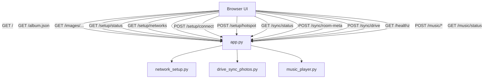

# API Reference

This file documents the Flask routes currently exposed by `app.py`.

## UI Routes

### `GET /`

Returns the inline HTML shell for the photo-frame UI.

Includes:

- CSS for the stage, operator tray, and setup overlay
- runtime config in `window.SANNY_CONFIG`
- frontend script tags

### `GET /album.json`

Returns the normalized album manifest used by the frontend.

### `GET /images/<filename>`

Serves a local image from:

1. `static/images/`
2. fallback `images/`

## Setup Routes

### `GET /setup/status`

Returns current Wi-Fi/setup status.

Useful for:

- showing the setup overlay
- checking whether hotspot mode is active
- showing the current SSID and setup URL

### `GET /setup/networks?rescan=1`

Returns visible Wi-Fi networks, or cached results if hotspot mode is already active.

Response shape:

```json
{
  "ok": true,
  "networks": [
    {
      "ssid": "HomeWiFi",
      "signal": 78,
      "security": "WPA2"
    }
  ],
  "error": ""
}
```

### `POST /setup/connect`

Request body:

```json
{
  "ssid": "HomeWiFi",
  "password": "secret"
}
```

Response shape:

```json
{
  "ok": true,
  "connected": true,
  "currentSsid": "HomeWiFi",
  "error": ""
}
```

### `POST /setup/hotspot`

Request body:

```json
{
  "enabled": true
}
```

Response shape:

```json
{
  "ok": true,
  "hotspotActive": true,
  "setupSsid": "Sanny Setup ame1",
  "error": ""
}
```

## Sync Routes

### `GET /sync/status`

Returns the current backend sync snapshot.

Includes:

- whether a Drive sync is currently running
- whether the last sync changed anything
- last success/error details
- local and room library fingerprints

### `POST /sync/room-meta`

Used by the browser to cache room metadata on the backend.

Request body:

```json
{
  "roomLibraryFingerprint": "room-fingerprint",
  "inSyncWithRoom": true
}
```

This is a helper route so the backend health and sync status stay aware of the room-level library state the browser sees.

### `POST /sync/drive`

Triggers a manual Google Drive sync.

No request body is required.

Behavior:

- returns `409` if another sync is already running
- returns `500` if Drive auth, dependencies, or sync logic fail
- rewrites local album metadata and image cache on success

## Health Route

### `GET /healthz`

Returns:

```json
{
  "ok": true,
  "albumCount": 90,
  "musicRunning": false,
  "lastSyncAt": null
}
```

The route considers:

- whether the album has at least one image
- whether the sync layer has a current backend error
- whether music appears to have failed after starting a track

## Music Routes

### `POST /music/playlist`

Loads a YouTube playlist or video URL.

Request body:

```json
{
  "playlist_url": "https://www.youtube.com/playlist?...",
  "start_index": 0,
  "paused": false
}
```

Response includes:

- `playlist`
- `now`
- `status`

### `POST /music/play_cached`

Tells the backend to play a specific already-loaded index.

Request body:

```json
{
  "index": 3,
  "paused": false
}
```

### `POST /music/next`

Moves to the next track.

### `POST /music/prev`

Moves to the previous track.

### `POST /music/pause`

Request body:

```json
{
  "paused": true
}
```

### `POST /music/toggle`

Toggles paused/running state.

### `POST /music/mute`

Request body:

```json
{
  "mute": true
}
```

### `POST /music/seek`

Request body:

```json
{
  "positionSeconds": 42.5
}
```

### `POST /music/stop`

Stops local playback.

### `GET /music/status`

Returns the current `mpv`-backed music status.

Typical shape:

```json
{
  "ok": true,
  "running": true,
  "paused": false,
  "muted": false,
  "index": 4,
  "ended": false,
  "positionSeconds": 42.5,
  "durationSeconds": 215.8,
  "track": {
    "title": "Current Song",
    "url": "https://www.youtube.com/watch?v=..."
  },
  "lastError": "",
  "logPath": "/tmp/sanny_mpv.log",
  "startedUrl": "/tmp/sanny_audio_cache/abc123.mp4"
}
```

## API Ownership Diagram


