# Function Call Map

This file is the visual companion to [Function Map](./function-map.md).

Instead of listing functions one by one, it shows how important functions call into each other during real runtime paths.

Because the project has several subsystems, the diagrams are split into smaller maps instead of one unreadable giant graph.

## How To Read These Diagrams

- Boxes are functions or methods
- Arrows show the usual call direction
- The diagrams focus on important runtime paths, not every tiny helper
- Some Flask routes are grouped by behavior so the visuals stay useful

## 1. Backend Composition In `app.py`

```mermaid
flowchart TD
    A[load_env_file] --> B[Flask app setup]
    B --> C[MPVPlayer()]
    B --> D[NetworkSetupManager()]
    B --> E[get_sync_status]
    E --> F[refresh_local_sync_snapshot]
    F --> G[load_album_manifest]
    G --> H[_read_json]
    G --> I[_normalize_album_entry]
    G --> J[_scan_images_directory]
    G --> K[compute_album_fingerprint]
```

## 2. Page Render Call Map

This is the path used when the browser requests `/`.

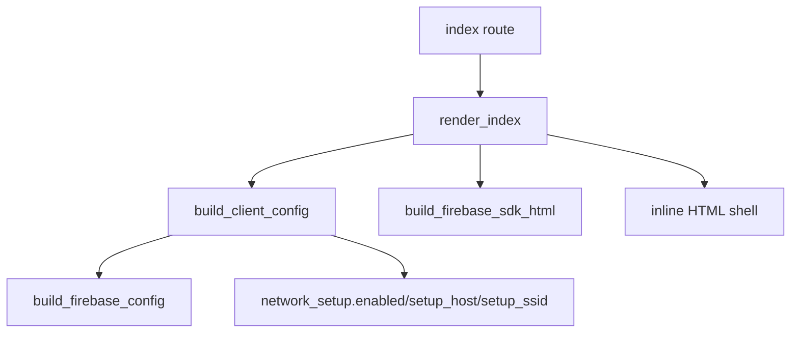

## 3. Album Manifest And Image Serving

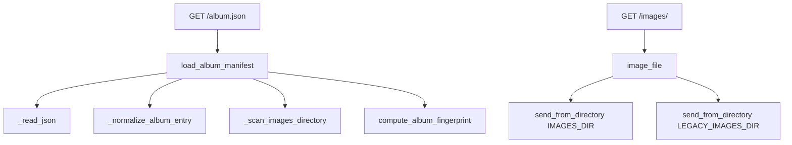

## 4. Setup Route Call Map

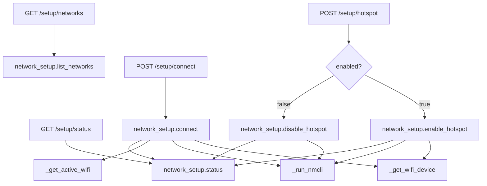

## 5. Sync Route Call Map

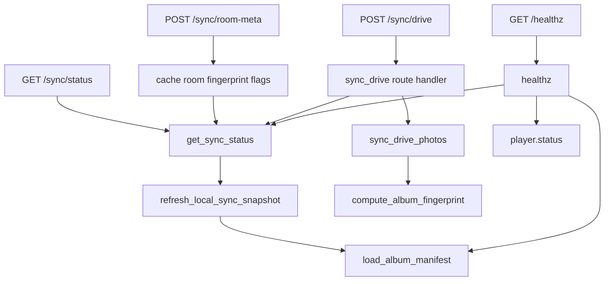

## 6. Music Route Call Map

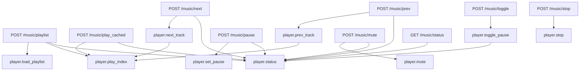

## 7. `drive_sync_photos.py` Main Call Graph

This is the most important backend call chain for large photo libraries.

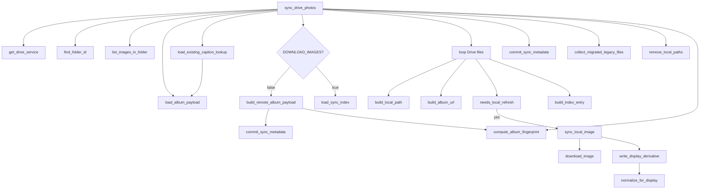

## 8. `music_player.py` Call Graph

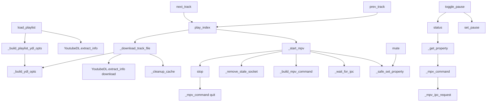

## 9. `network_setup.py` Call Graph

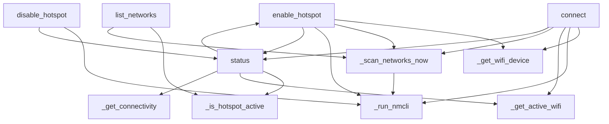

## 10. Frontend Boot Call Map

This shows how the browser-side modules come online after the page loads.

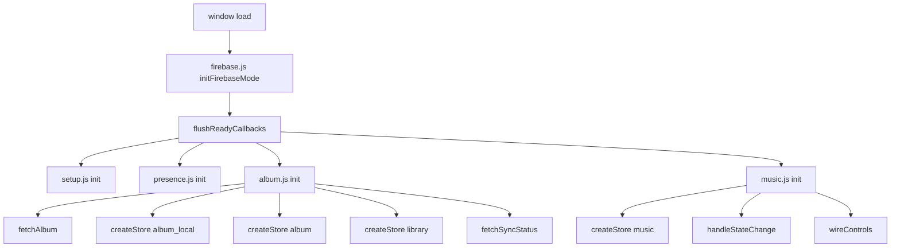

## 11. `album.js` Main Call Graph

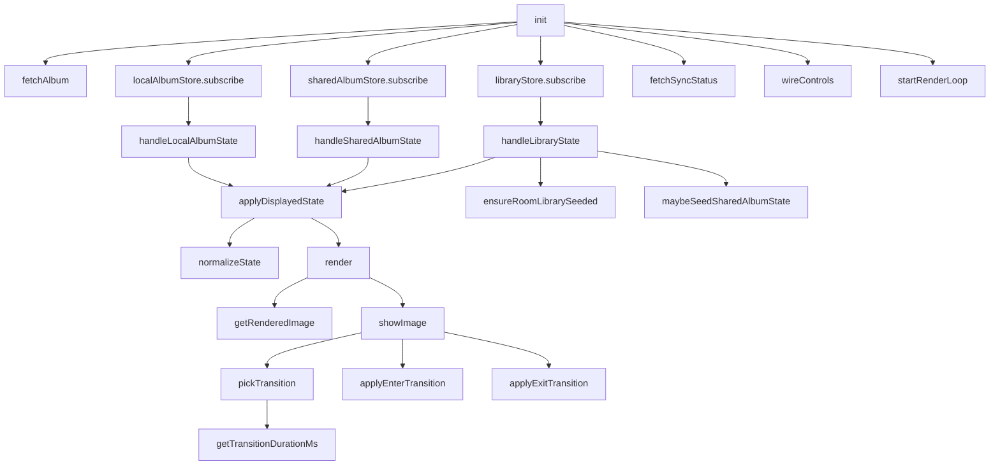

## 12. `album.js` User Interaction Call Map

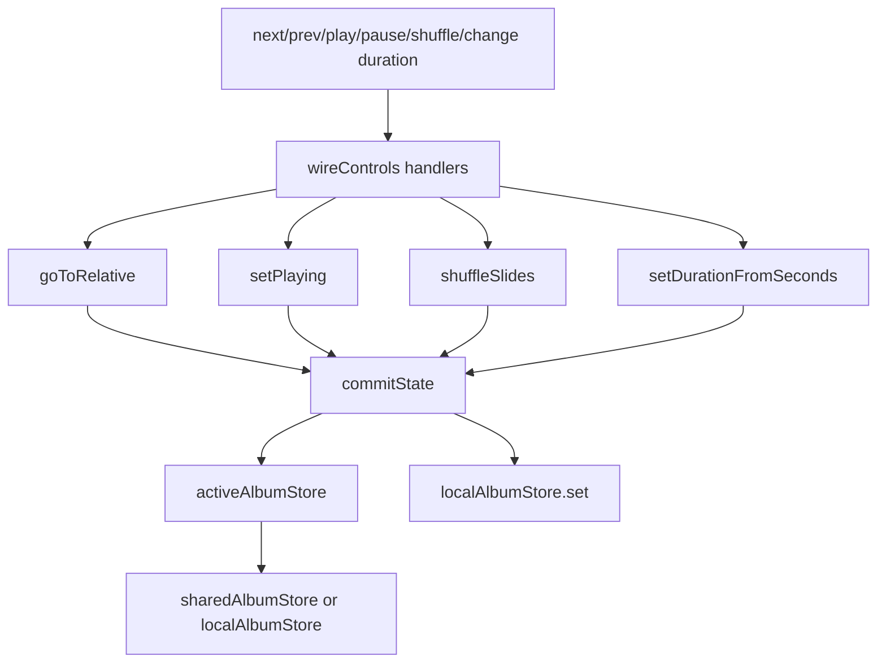

## 13. `album.js` Drive Sync UI Call Map

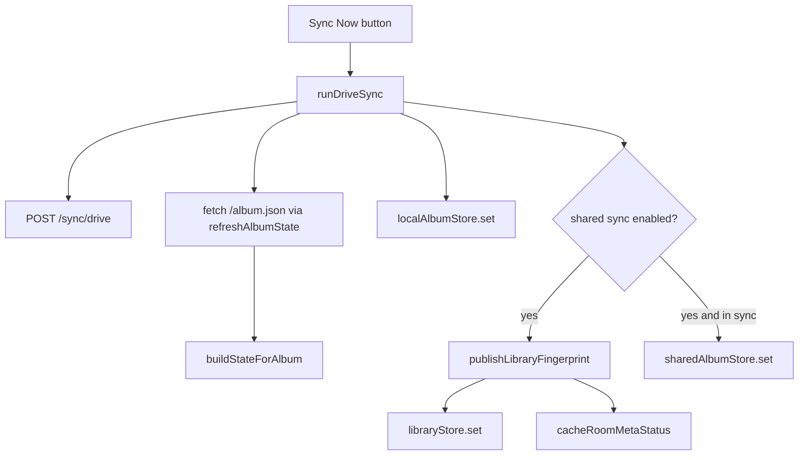

## 14. `music.js` Call Graph

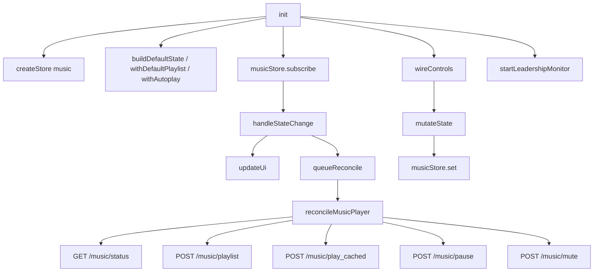

## 15. Cross-Module Runtime Path

This is the shortest useful end-to-end "big picture" function map.

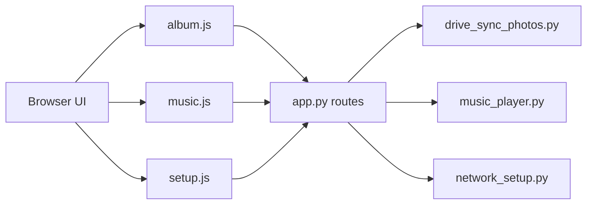

## Practical Reading Advice

If you want to understand the code in a useful order:

1. Start with the backend overview maps above for `app.py`.
2. Then read the `album.js` call graphs, because slideshow behavior is the heart of the product.
3. Then read `drive_sync_photos.py` and `music_player.py`, because those are the two big integration engines.
4. Use the non-visual [Function Map](./function-map.md) afterward when you need exact names and responsibilities.
