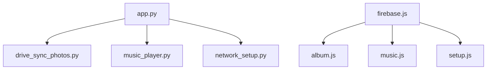

# Function Map

For the diagram version of these relationships, see [Function Call Map](./function-call-map.md).

This is the module-by-module function inventory for the current codebase.

The goal is not just to list names, but to explain ownership and intent.

## `app.py`

### Boot and config helpers

| Function | Purpose |
| --- | --- |
| `load_env_file()` | Loads `device.env` into `os.environ` without overriding existing vars |
| `_read_json(path)` | Reads a JSON file from disk |
| `_normalize_album_entry(entry, index)` | Converts raw manifest items into a normalized slideshow item |
| `_scan_images_directory()` | Builds a fallback image list by scanning `static/images/` |
| `load_album_manifest()` | Loads the canonical album, falls back to legacy sources, computes fingerprint |
| `build_firebase_config()` | Builds Firebase web config from environment variables |
| `build_client_config()` | Builds `window.SANNY_CONFIG` for the browser |
| `build_firebase_sdk_html(enabled)` | Conditionally injects Firebase CDN script tags |
| `iso_now()` | Returns an ISO UTC timestamp |
| `refresh_local_sync_snapshot()` | Refreshes backend sync status from the current manifest |
| `get_sync_status(ok=None)` | Returns the current backend sync snapshot |
| `render_index()` | Builds the final HTML shell sent to the browser |

### Flask routes

| Route function | Route | Purpose |
| --- | --- | --- |
| `index()` | `GET /` | Serves the single-page UI |
| `album_json()` | `GET /album.json` | Serves the normalized album manifest |
| `image_file(filename)` | `GET /images/<path>` | Serves local images with legacy fallback |
| `setup_status()` | `GET /setup/status` | Returns Wi-Fi/setup status |
| `setup_networks()` | `GET /setup/networks` | Returns visible or cached SSIDs |
| `setup_connect()` | `POST /setup/connect` | Connects to a chosen Wi-Fi network |
| `setup_hotspot()` | `POST /setup/hotspot` | Opens or closes the setup hotspot |
| `sync_status()` | `GET /sync/status` | Returns sync status |
| `sync_room_meta()` | `POST /sync/room-meta` | Stores room library metadata seen by the browser |
| `sync_drive()` | `POST /sync/drive` | Runs manual Google Drive sync |
| `healthz()` | `GET /healthz` | Returns compact health info |
| `music_playlist()` | `POST /music/playlist` | Loads a playlist and starts playback |
| `music_play_cached()` | `POST /music/play_cached` | Switches to an already loaded track index |
| `music_next()` | `POST /music/next` | Advances to next track |
| `music_prev()` | `POST /music/prev` | Moves to previous track |
| `music_pause()` | `POST /music/pause` | Sets paused/running state |
| `music_toggle()` | `POST /music/toggle` | Toggles paused/running state |
| `music_mute()` | `POST /music/mute` | Sets local mute state |
| `music_seek()` | `POST /music/seek` | Seeks the local player to a shared room position |
| `music_stop()` | `POST /music/stop` | Stops playback |
| `music_status()` | `GET /music/status` | Returns backend music status |

## `drive_sync_photos.py`

### Auth and validation

| Function | Purpose |
| --- | --- |
| `get_drive_service(token_path=None)` | Creates the Google Drive API client from the stored OAuth token |
| `require_image_pipeline()` | Ensures Pillow is available before local derivative generation |

### Drive discovery

| Function | Purpose |
| --- | --- |
| `find_folder_id(service, name)` | Finds the target Drive folder ID by name |
| `list_images_in_folder(service, folder_id)` | Lists image files in the chosen Drive folder |

### JSON and manifest loading

| Function | Purpose |
| --- | --- |
| `load_json_payload(path, default)` | Safe JSON loader with default fallback |
| `load_album_payload(path=None)` | Reads the current album manifest |
| `load_sync_index(path=None)` | Reads the incremental sync index |
| `load_existing_caption_lookup(path=None)` | Builds a caption lookup from existing manifest data |
| `resolve_caption(lookup, file_id, url)` | Resolves caption by Drive file ID or URL |
| `normalize_album_entry(entry)` | Normalizes a manifest entry for Drive/caption logic |
| `compute_album_fingerprint(payload)` | Computes the stable library fingerprint |

### Path and naming helpers

| Function | Purpose |
| --- | --- |
| `build_local_filename(file_id)` | Creates the on-device filename for a Drive image |
| `build_local_path(file_id, image_dir=None)` | Builds the full local path for a Drive image |
| `build_album_url(file_id)` | Builds the manifest URL for a local derivative |

### File writing and image processing

| Function | Purpose |
| --- | --- |
| `write_json_temp(payload, destination_path)` | Writes JSON to a temp file for atomic replace |
| `download_image(service, file_id, destination_path)` | Downloads a Drive file to disk |
| `normalize_for_display(image)` | Applies EXIF transpose, RGB conversion, and max-edge resize |
| `write_display_derivative(source_path, destination_path)` | Writes the screen-sized derivative file |

### Incremental sync decisions

| Function | Purpose |
| --- | --- |
| `needs_local_refresh(index_entry, file_info, local_path)` | Decides whether a local image must be regenerated |
| `sync_local_image(service, file_info, destination_path)` | Downloads and converts a single image |
| `build_index_entry(file_info, local_path, url)` | Stores per-image sync metadata in the index |
| `collect_migrated_legacy_files(previous_payload, next_urls_by_id)` | Finds legacy files that should be deleted after migration |
| `remove_local_paths(paths)` | Best-effort deletion helper |
| `commit_sync_metadata(album_payload, sync_index, album_path=None, index_path=None)` | Atomically commits manifest and index files |
| `build_remote_album_payload(files, caption_lookup)` | Builds a remote-URL-only manifest when local downloads are disabled |

### Main entry points

| Function | Purpose |
| --- | --- |
| `sync_drive_photos(service=None)` | Main sync pipeline |
| `main()` | CLI entry point |

## `music_player.py`

This file mainly exposes one class: `MPVPlayer`.

### Constructor and process helpers

| Method | Purpose |
| --- | --- |
| `__init__()` | Configures paths, cache settings, volume, and runtime state |
| `_is_running()` | Checks whether the `mpv` process is alive |
| `_remove_stale_socket()` | Deletes an old IPC socket if present |
| `_close_log_handle()` | Closes the mpv log file handle |
| `_wait_for_ipc()` | Waits for the mpv IPC socket to appear |
| `_read_log_tail()` | Reads the tail of the mpv log file |
| `_build_mpv_command(url, headers=None)` | Builds the actual `mpv` command |
| `_start_mpv(url, headers=None)` | Starts playback and re-applies mute/pause state |

### IPC helpers

| Method | Purpose |
| --- | --- |
| `_mpv_ipc_request(payload)` | Sends a request to the mpv UNIX socket |
| `_mpv_command(*args)` | Convenience wrapper for mpv commands |
| `_get_property(name)` | Reads an mpv property |
| `_set_property(name, value)` | Writes an mpv property |
| `_safe_set_property(name, value)` | Best-effort property update that records errors |

### `yt-dlp` helpers

| Method | Purpose |
| --- | --- |
| `_build_ydl_opts(include_cookies=False, **extra)` | Base `yt-dlp` option builder |
| `_build_playlist_ydl_opts(include_cookies=False)` | Playlist metadata options |
| `_cleanup_cache(keep_path=None)` | Trims old/overflow audio cache files |
| `_download_track_file(track_url)` | Downloads a playable local audio file |

### Public music operations

| Method | Purpose |
| --- | --- |
| `load_playlist(playlist_url)` | Resolves a playlist into local track metadata |
| `play_index(index, paused=False)` | Downloads the current track and starts `mpv` |
| `next_track()` | Plays next track |
| `prev_track()` | Plays previous track |
| `set_pause(paused=True)` | Sets pause state |
| `toggle_pause()` | Toggles pause state |
| `mute(mute=True)` | Sets local mute state |
| `seek(position_seconds)` | Seeks the current track |
| `stop()` | Stops the current `mpv` process |
| `status()` | Returns current music state |

## `network_setup.py`

### Module helpers

| Function | Purpose |
| --- | --- |
| `_env_flag(name, default=False)` | Parses boolean-ish environment flags |
| `_split_nmcli_fields(line)` | Splits colon-separated `nmcli -t` output safely |

### `NetworkSetupManager`

| Method | Purpose |
| --- | --- |
| `__init__(port)` | Configures setup-mode behavior and NetworkManager integration |
| `_build_setup_ssid()` | Builds the hotspot SSID from hostname/prefix |
| `_touch_activity()` | Updates activity timestamp for idle shutdown logic |
| `_run_nmcli(*args, check=True, timeout=30)` | Runs `nmcli` and handles failures |
| `_get_wifi_device()` | Finds the Wi-Fi adapter |
| `_get_active_wifi()` | Finds the current connected SSID |
| `_get_connectivity()` | Reads NetworkManager connectivity state |
| `_is_hotspot_active()` | Checks whether the setup hotspot is active |
| `_scan_networks_now(rescan)` | Performs a Wi-Fi scan |
| `list_networks(rescan=True)` | Public network scan API |
| `enable_hotspot()` | Starts the setup hotspot |
| `disable_hotspot()` | Stops the setup hotspot |
| `connect(ssid, password="")` | Joins a chosen Wi-Fi network |
| `status(manage=True)` | Returns current setup/network state and manages auto-setup behavior |

## `creds/drive_auth_local.py`

| Function | Purpose |
| --- | --- |
| `main()` | Runs the local OAuth browser flow and saves `creds/token.json` |

## `static/js/firebase.js`

This file creates the sync abstraction used by the other frontend modules.

### Core helpers

| Function | Purpose |
| --- | --- |
| `clone(value)` | Deep-ish clone via JSON serialization |
| `resolveScope(name, options)` | Chooses local vs shared store scope |
| `createLocalStore(name)` | Creates a localStorage/BroadcastChannel-backed store |
| `createFirebaseStore(name)` | Creates a Firebase RTDB-backed store |
| `flushReadyCallbacks()` | Flushes queued `onReady` callbacks |
| `initLocalMode(reason)` | Initializes fallback local sync mode |
| `initFirebaseMode()` | Initializes Firebase, anonymous auth, and server time offset |

### Important exported concept

- `window.SannySync.onReady(callback)` gives downstream modules a sync context with:
  - `deviceId`
  - `roomId`
  - `syncEnabled`
  - `syncSlidesEnabled`
  - `syncMusicEnabled`
  - `serverNow()`
  - `createStore(name, options)`

## `static/js/album.js`

This is the largest frontend module and the main slideshow brain.

### Image and state normalization

| Function | Purpose |
| --- | --- |
| `now()` | Uses Firebase-adjusted server time when available |
| `normalizeImageUrl(url)` | Converts local image URLs into served paths |
| `normalizeImages(rawImages)` | Normalizes manifest items for the frontend |
| `clampDurationMs(value)` | Bounds slide duration |
| `identityOrder(length)` | Creates a non-shuffled slide order |
| `normalizeOrder(order)` | Validates or repairs order arrays |
| `normalizeState(rawState)` | Normalizes slideshow state |
| `buildDefaultState()` | Creates initial slideshow state |
| `getEffectiveSequenceIndex(state, at)` | Derives the current sequence index from time |
| `getRenderedImage(state, at)` | Resolves the current visible image |
| `getCurrentImageUrl()` | Returns the current displayed image URL |
| `computeLocalFingerprint(imagesList)` | Computes a fallback local fingerprint |

### Transition and rendering helpers

| Function | Purpose |
| --- | --- |
| `prefersReducedMotion()` | Honors reduced-motion preference |
| `getTransitionDurationMs()` | Computes transition duration from slide timing |
| `getTransitionWeight(preset)` | Weights transition selection |
| `pickTransition(previousImage, nextImage)` | Picks a random transition without immediate repeat |
| `clearTransitionVariables(element)` | Clears CSS custom properties |
| `resetPhotoElement(element, opacity)` | Resets image element state |
| `applyEnterTransition(element, preset, durationMs)` | Applies incoming animation |
| `applyExitTransition(element, preset, durationMs)` | Applies outgoing animation |
| `showImage(image, previousImage, sequenceIndex)` | Swaps image elements and runs transitions |
| `render(force)` | Renders the current slideshow state |
| `startRenderLoop()` | Starts periodic rendering |

### Album loading and sync behavior

| Function | Purpose |
| --- | --- |
| `fetchAlbum()` | Loads `/album.json` |
| `buildStateForAlbum(baseState, preferredImageUrl, manifestVersion)` | Rebuilds state after album changes |
| `shouldUseSharedAlbum()` | Decides whether room slideshow state is allowed |
| `activeAlbumStore()` | Chooses shared or local state store |
| `cacheRoomMetaStatus()` | Pushes room fingerprint status back to Flask |
| `renderSyncStatus()` | Updates tray sync message |
| `fetchSyncStatus()` | Pulls backend sync status |
| `ensureRoomLibrarySeeded()` | Seeds room library metadata if missing |
| `publishLibraryFingerprint()` | Publishes local library metadata to the room |
| `maybeSeedSharedAlbumState()` | Seeds shared slideshow state if absent |
| `applyDisplayedState(sourceState)` | Applies either local or shared state to the UI |
| `handleLocalAlbumState(nextState)` | Handles local store updates |
| `handleSharedAlbumState(nextState)` | Handles shared store updates |
| `handleLibraryState(nextState)` | Enables/disables room sync based on fingerprint match |
| `refreshAlbumState(preferredImageUrl, manifestVersion)` | Reloads album after sync and preserves current photo if possible |
| `runDriveSync()` | Calls `POST /sync/drive` and updates local/shared state |

### User interactions

| Function | Purpose |
| --- | --- |
| `commitState(mutator)` | Writes slideshow state changes |
| `goToRelative(offset)` | Goes to next or previous slide |
| `setPlaying(isPlaying)` | Pauses/resumes slideshow |
| `setDurationFromSeconds(seconds)` | Changes slide duration |
| `shuffleSlides()` | Shuffles while keeping current image visible |
| `shouldIgnoreKeyboardTarget(target)` | Avoids stealing keystrokes from inputs |
| `clearTrayHideTimer()` | Clears tray auto-hide timer |
| `scheduleTrayHide()` | Starts tray auto-hide timer |
| `setTrayOpen(open)` | Opens/closes the operator tray |
| `markTrayActivity()` | Extends tray visibility timeout |
| `updateTrayContext()` | Updates the tray heading text |
| `clearTrayLongPress()` | Clears touch long-press timer |
| `startTrayLongPress(event)` | Supports top-right touch long-press |
| `wireControls()` | Wires buttons, keys, touch, and tray controls |
| `cacheDom()` | Caches DOM elements |
| `init(syncContext)` | Initializes the entire slideshow module |

## `static/js/music.js`

### State and transport helpers

| Function | Purpose |
| --- | --- |
| `now()` | Current timestamp helper |
| `isSharedMusicMode()` | Checks whether music should use shared sync |
| `setMusicLabel(text, isError)` | Updates title/error display |
| `fetchJSON(url, options)` | Fetch helper with timeout |
| `postJSON(url, body)` | JSON POST helper |
| `getJSON(url)` | JSON GET helper |
| `normalizeState(rawState)` | Normalizes music state |
| `buildDefaultState()` | Creates default music state |
| `withDefaultPlaylist(state)` | Injects default playlist if empty |
| `withAutoplay(state)` | Forces autoplay on stored playlist state |

### Leadership helpers

| Function | Purpose |
| --- | --- |
| `isLeaderFor(state)` | Checks whether this device owns playback |
| `isLeaderStale(state)` | Checks whether leader heartbeat is stale |
| `claimLeadership()` | Claims music leadership in shared mode |
| `startHeartbeat()` | Keeps leader heartbeat fresh |
| `stopHeartbeat()` | Stops leader heartbeat |
| `startLeadershipMonitor()` | Tries to reclaim stale leadership |

### Playback orchestration

| Function | Purpose |
| --- | --- |
| `queueReconcile()` | Queues playback reconciliation work |
| `stopLocalPlayback()` | Stops the backend player |
| `updateUi()` | Updates labels and button state |
| `reconcileMusicPlayer()` | Aligns backend playback with current state |
| `mutateState(mutator)` | Writes music state changes |
| `wireControls()` | Connects UI buttons and playlist input |
| `handleStateChange(nextState)` | Responds to store updates |
| `init(syncContext)` | Initializes music state and subscriptions |

## `static/js/setup.js`

| Function | Purpose |
| --- | --- |
| `setBusy(nextBusy)` | Disables/enables setup controls during requests |
| `setBanner(text, tone)` | Updates setup banner text and status tone |
| `openSetupOverlay()` | Opens the Wi-Fi setup overlay |
| `hideSetupOverlay()` | Temporarily snoozes the overlay |
| `fetchJSON(url, options)` | Setup-specific fetch helper |
| `renderNetworks(networks)` | Renders the SSID list |
| `renderStatus(status)` | Renders current setup/network state |
| `pollStatus()` | Refreshes setup status |
| `scanNetworks(forceRescan)` | Loads available Wi-Fi networks |
| `connectToWifi()` | Submits chosen SSID/password |
| `toggleHotspot(enabled)` | Starts or stops the setup hotspot |
| `wireEvents()` | Hooks up buttons, inputs, and `Esc` |
| `startPolling()` | Starts periodic polling |

## `static/js/presence.js`

| Function | Purpose |
| --- | --- |
| `now()` | Timestamp helper |
| `buildPresence(deviceId, online)` | Builds a presence patch payload |
| `touch(online)` | Internal callback that updates room presence |

## Functional Ownership Summary

